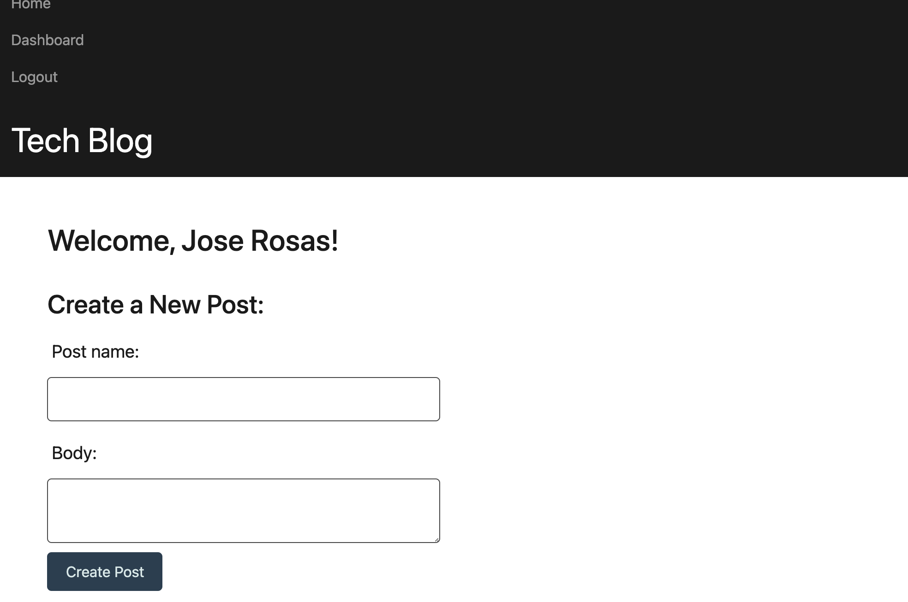

# Tech-Blog

# Description

This is a tech blog. Create an account. Write and view blogs and comment on them!
# Table of Contents

* [Installation](#installation)
* [Usage](#usage)
* [Technology](#technology)
* [Features](#features)
* [Contribution](#contribution)
* [Questions](#questions)

# Deployed Website: 
[Tech-Blog](https://tech-blog-josejrrosas.up.railway.app/)

# Screenshot :

|


# User Story

```
AS A developer who writes about tech

I WANT a CMS-style blog site

SO THAT I can publish articles, blog posts, and my thoughts and opinions
```
# Installation

1. Clone this repository to your local machine.

2. Run `npm install` to install dependencies required for this project.

3. Run `node server.js` to start the application.


# Usage

* Create Bogs

* Comment on Blogs

* View others' blogs.

# Technology

**1. [Sequelize]

**2. [Bcrypt]

**3. [Express.js]

**4. [Node.js]
# Features

1. MySQL and Sequelize is used to create database for this application.

2. Express server is used to handle routing.

3. User can create, view, and comment on blogs.

# Contribution

Please let me know how I can improve this project. Issues and pull requests are always welcome.

# Questions 

If you have any questions about the repo, 
contact me directly at [Email](mailto:josejrrosas@yahoo.com).